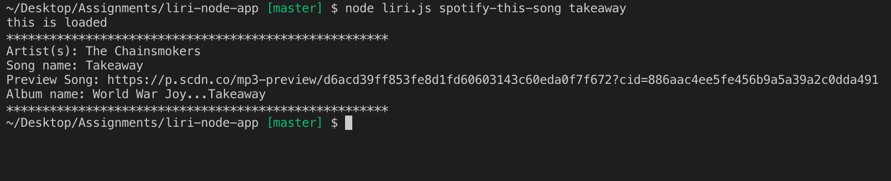
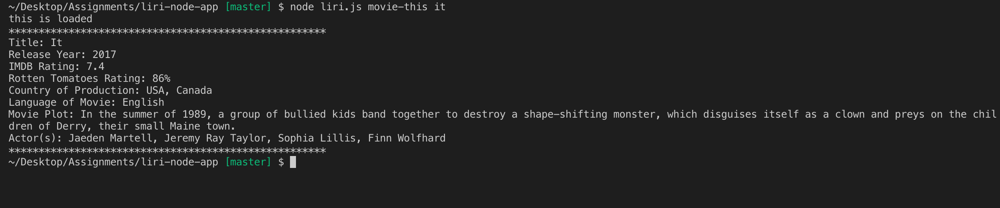
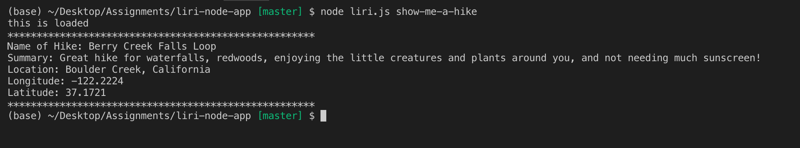
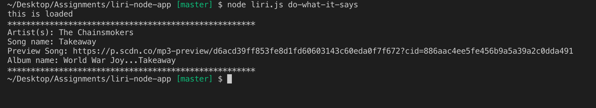

# liri-node-app

Just like Siri which takes in voice commands and returns information. The liri node app takes in a few commands 
concert-this, spotify-this-song, movie-this, and do-what-it-says.

To initiate the app, user must go to terminal and head to the file directory. Start by inputting in the terminal node liri.js command and then user input in order for liri to give a response back. 

Concert-this command works with bandsintown api to return band or artist information such as lineup name, and venue information.

     

Spotify-this-song command returns information for a song and the spotify api is used. The song title is needed after the command and liri would return several
songs based on the title.

     

Movie-this returns information on a movie and the omdbapi is used. Information like Rottentomatoes ratings, actors, language, plot and release year are returned to the user. 

     

show-me-a-hike returns a description about a hike. User doesn't have to put any inputs other than the command.
Hiking trail information is taken from hikingproject.com with latitude and longitude of the trail in order to query for the information. 

     

Do-what-it-says just returns information that is stored in another file. User doens't have to put any other input other than the command do-what-it-says. 

     

