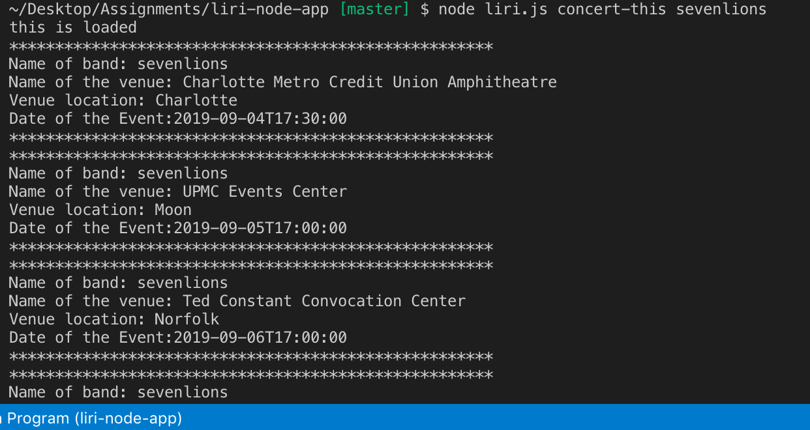

# liri-node-app

Just like Siri which takes in voice commands and returns information. The liri node app takes in a few commands 
concert-this, spotify-this-song, movie-this, and do-what-it-says.

Concert-this command works with bandsintown api to return band or artist information such as lineup name, and venue information.

     

Spotify-this-song command returns information for a song and the spotify api is used. The song title is needed after the command and liri would return several
songs based on the title.

     

Movie-this returns information on a movie and the omdbapi is used. Information like Rottentomatoes ratings, actors, language, plot and release year are returned to the user. 

     

Do-what-it-says just returns information that is stored in another file. User doens't have to put any other input other than the command do-what-it-says. 

     

